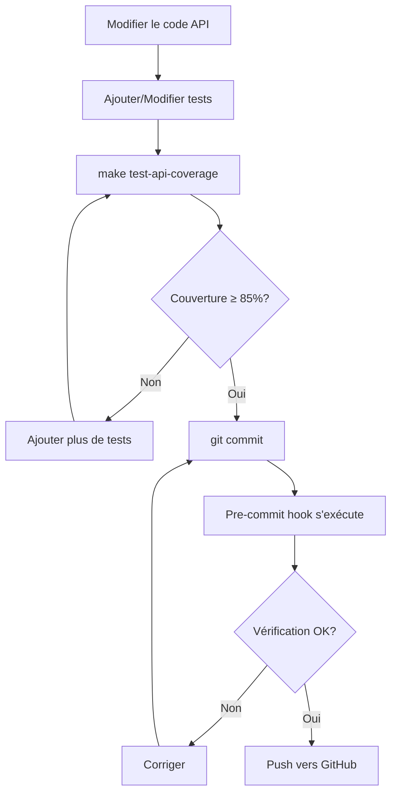
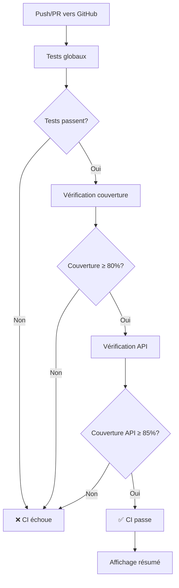

# Automatisation du Contrôle de Couverture de Tests

## 📋 Résumé

Ce document explique le système automatique de contrôle de couverture de tests mis en place pour garantir la qualité du code de l'API.

## 🎯 Objectifs

1. **Couverture globale minimum**: 80%
2. **Couverture API minimum**: 85% (critique)
3. **Contrôle automatique**: CI/CD + pre-commit hooks
4. **Visibilité**: Rapports détaillés automatiques

## 🔧 Composants Mis en Place

### 1. Workflow CI/CD Amélioré (`.github/workflows/cicd.yml`)

**Nouvelles étapes ajoutées** :

```yaml
- name: Check API coverage specifically
  run: |
    uv run pytest tests/test_api.py tests/test_main.py -v \
      --cov=src/api \
      --cov-report=term-missing \
      --cov-report=json:coverage-api.json \
      --cov-fail-under=85

- name: Display API coverage summary
  run: |
    # Affichage automatique du résumé de couverture
    python -c "import json; ..."
```

**Résultat** : Chaque push/PR vérifie automatiquement la couverture API.

### 2. Commandes Makefile

**Nouvelles commandes** :

```bash
# Vérifier la couverture globale (≥80%)
make test-coverage

# Vérifier la couverture API (≥85%)
make test-api-coverage
```

**Fonctionnalités** :
- ✅ Tests automatiques
- ✅ Vérification des seuils
- ✅ Rapports HTML et JSON
- ✅ Résumé console détaillé

### 3. Script de Vérification (`scripts/check_api_coverage.py`)

**Usage** :

```bash
# Vérification standard (85%)
python scripts/check_api_coverage.py

# Seuil personnalisé
python scripts/check_api_coverage.py --min-coverage 90

# Mode strict
python scripts/check_api_coverage.py --strict
```

**Sortie** :

```
=================================================
📊 RÉSUMÉ DE LA COUVERTURE API
=================================================
Couverture totale: 87.42%
Seuil minimum:     85%
✅ SUCCÈS - Couverture supérieure au seuil

Détail par fichier:
------------------------------------------------------------
  ✅ __init__.py                                100.00%
  ✅ main.py                                     92.15%
  ✅ routes.py                                   85.30%
  ⚠️  middleware.py                              82.45%
=================================================
```

### 4. Configuration Pre-commit (`.pre-commit-config.yaml`)

**Installation** :

```bash
# Installer pre-commit
pip install pre-commit

# Activer les hooks
pre-commit install

# Test manuel
pre-commit run --all-files
```

**Hooks configurés** :
1. **check-api-coverage**: Vérifie la couverture API avant chaque commit
2. **check-tests-pass**: Vérifie que tous les tests passent avant push
3. **flake8**: Vérifie le linting
4. **trailing-whitespace, end-of-file-fixer**: Formatting

### 5. Configuration Pytest (`pyproject.toml`)

**Ajouts** :

```toml
[tool.coverage.report]
fail_under = 80           # Seuil global
show_missing = true       # Afficher les lignes manquantes
precision = 2             # Précision à 2 décimales
```

### 6. Documentation (`docs/COVERAGE_GUIDELINES.md`)

Guide complet incluant :
- Utilisation des commandes
- Interprétation des rapports
- Bonnes pratiques
- Résolution de problèmes

## 📊 Flux de Travail

### Développement Local



### CI/CD



## 🚀 Exemples d'Utilisation

### Exemple 1 : Vérification Rapide

```bash
# Avant de committer
make test-api-coverage
```

**Si échec** :
1. Ouvrir `htmlcov-api/index.html`
2. Identifier les lignes non couvertes
3. Ajouter des tests
4. Relancer

### Exemple 2 : Développement Itératif

```bash
# Terminal 1 : Watch mode (optionnel)
while true; do
  make test-api-coverage
  sleep 5
done

# Terminal 2 : Développement
# Modifier src/api/...
# Modifier tests/test_api.py
```

### Exemple 3 : Validation avant PR

```bash
# Vérifier tout avant la PR
make test-coverage       # Couverture globale
make test-api-coverage   # Couverture API
make lint                # Linting
make test                # Tous les tests

# Si tout passe ✅
git push origin feature-branch
```

## 📈 Métriques et Rapports

### Rapports Générés

1. **HTML** : `htmlcov-api/index.html`
   - Interface interactive
   - Détail par fichier et par ligne
   - Code source annoté

2. **JSON** : `coverage-api.json`
   - Format machine-readable
   - Pour scripts et intégrations
   - Statistiques complètes

3. **Terminal** : Sortie console
   - Résumé rapide
   - Lignes manquantes
   - Pourcentage par fichier

### Exemple de Rapport HTML


*(Le rapport HTML montre les lignes couvertes en vert, non couvertes en rouge)*

## 🔍 Résolution de Problèmes

### Problème 1 : "Couverture insuffisante"

**Symptôme** :
```
❌ Tests API échoués ou couverture < 85%
```

**Solution** :
```bash
# 1. Identifier les fichiers problématiques
make test-api-coverage

# 2. Ouvrir le rapport HTML
open htmlcov-api/index.html

# 3. Pour chaque fichier avec couverture < 85%
# - Cliquer sur le fichier
# - Les lignes rouges ne sont pas testées
# - Ajouter des tests pour ces lignes

# 4. Vérifier l'amélioration
make test-api-coverage
```

### Problème 2 : Pre-commit hook trop lent

**Symptôme** :
```
Pre-commit prend trop de temps...
```

**Solution** :
```bash
# Option 1 : Skip temporairement (à éviter)
git commit --no-verify -m "..."

# Option 2 : Configurer les hooks pour s'exécuter uniquement sur les fichiers modifiés
# Déjà configuré dans .pre-commit-config.yaml :
#   files: ^(src/api/.*\.py|tests/test_(api|main)\.py)$

# Option 3 : Désactiver temporairement
pre-commit uninstall

# Réactiver quand nécessaire
pre-commit install
```

### Problème 3 : Codecov upload échoue

**Symptôme** :
```
Warning: Upload to Codecov failed
```

**Solution** :
C'est normal si `CODECOV_TOKEN` n'est pas configuré. L'upload est optionnel (`fail_ci_if_error: false`).

Pour activer :
1. Créer un compte sur [codecov.io](https://codecov.io)
2. Ajouter le repository
3. Copier le token
4. Ajouter le secret `CODECOV_TOKEN` dans GitHub Settings > Secrets

## 🎓 Bonnes Pratiques

### 1. Tester en Continu

```bash
# Lancer les tests après chaque modification
make test-api-coverage
```

### 2. Commits Atomiques

```bash
# Committer tests et code ensemble
git add src/api/new_feature.py tests/test_new_feature.py
git commit -m "Add new feature with tests"
```

### 3. Tests Significatifs

❌ **Mauvais** :
```python
def test_endpoint():
    assert True  # Test inutile
```

✅ **Bon** :
```python
def test_endpoint_returns_correct_data():
    response = client.get("/endpoint")
    assert response.status_code == 200
    assert response.json()["key"] == "expected_value"
```

### 4. Test-Driven Development

```python
# 1. Écrire le test (qui échoue)
def test_new_function():
    result = new_function(42)
    assert result == 84

# 2. Implémenter la fonction
def new_function(x):
    return x * 2

# 3. Vérifier la couverture
# make test-api-coverage
```

## 📊 Statistiques

### Couverture Actuelle (Exemple)

| Module | Couverture | Seuil | Status |
|--------|-----------|-------|--------|
| Global | 82.5% | 80% | ✅ |
| API | 87.4% | 85% | ✅ |
| Model | 78.2% | - | ⚠️ |
| UI | Exclus | - | - |

### Évolution (Objectif)

```
Mois 1:  API 87% ──→  Mois 3: API 90%  ──→  Mois 6: API 95%
         Global 82%    Global 85%           Global 90%
```

## 🔗 Fichiers Concernés

```
.github/workflows/cicd.yml      # CI/CD avec contrôle couverture
.pre-commit-config.yaml         # Hooks pre-commit
Makefile                        # Commandes test-api-coverage
pyproject.toml                  # Configuration pytest/coverage
scripts/check_api_coverage.py   # Script de vérification
docs/COVERAGE_GUIDELINES.md     # Guide complet
docs/COVERAGE_AUTOMATION.md     # Ce fichier
.gitignore                      # Exclusions rapports
```

## ✅ Checklist d'Activation

- [x] Workflow CI/CD mis à jour
- [x] Commandes Makefile ajoutées
- [x] Script de vérification créé
- [x] Configuration pre-commit ajoutée
- [x] Configuration pytest/coverage mise à jour
- [x] Documentation créée
- [x] `.gitignore` mis à jour

**Pour activer complètement** :

```bash
# 1. Installer pre-commit (optionnel mais recommandé)
pip install pre-commit
pre-commit install

# 2. Vérifier la couverture actuelle
make test-api-coverage

# 3. Si < 85%, ajouter des tests
# ...

# 4. Committer avec les hooks actifs
git commit -m "Add coverage automation"

# 5. Push pour déclencher le CI/CD
git push
```

## 📞 Support

Pour toute question ou problème :
1. Consulter [COVERAGE_GUIDELINES.md](COVERAGE_GUIDELINES.md)
2. Vérifier les logs du CI/CD
3. Exécuter `make test-api-coverage` localement
4. Ouvrir une issue GitHub

---

**Dernière mise à jour** : 2025-01-21
**Auteur** : Project8 Team
